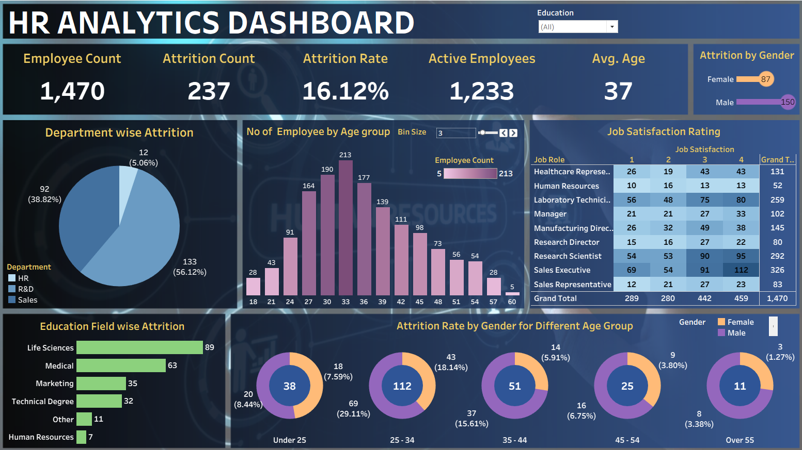

# HR Analytics Dashboard | Tableau Project

This project focuses on **HR Analytics** using **Tableau** to analyze employee data and uncover insights related to **attrition, workforce demographics, job satisfaction, and employee distribution**.  
The dashboard helps HR teams understand key factors influencing employee attrition and make data-driven decisions to improve retention and workforce planning.

---

## 📊 Dashboard Preview

---

## 📂 Dataset Overview

The dataset contains employee-level HR information with the following key attributes:

- **Employee ID**
- **Age**
- **Gender**
- **Department**
- **Job Role**
- **Education & Education Field**
- **Attrition Status**
- **Job Satisfaction Rating**
- **Active Employee Status**

Dataset file:
- `HR Data.xlsx`

---

## 🛠 Tools & Technologies Used

| Tool | Purpose |
|-----|--------|
| **Tableau** | Data visualization & dashboard creation |
| **Excel** | Source data storage |
| **Calculated Fields** | KPI & metric creation |
| **Filters & Parameters** | Interactive analysis |

---

## 🔄 Analysis Performed

1. **Employee Overview**
   - Total employees
   - Active employees
   - Average age

2. **Attrition Analysis**
   - Overall attrition count and rate
   - Attrition by department
   - Attrition by gender
   - Attrition by education field

3. **Demographic Analysis**
   - Employee count by age group
   - Gender-based attrition across age groups

4. **Job Satisfaction Analysis**
   - Job satisfaction rating by job role
   - Comparison across satisfaction levels

---

## 📈 Key Insights

- **Total Employees:** 1,470  
- **Attrition Count:** 237  
- **Attrition Rate:** 16.12%  
- **Average Employee Age:** 37  
- Highest attrition observed in **Sales** department
- Employees aged **25–34** show the highest attrition
- **Male employees** have higher attrition compared to females
- Lower job satisfaction ratings correlate with higher attrition

---

## 🧠 Business Recommendations

- Improve retention strategies for **Sales and R&D departments**
- Focus engagement programs on employees aged **25–34**
- Enhance job satisfaction through career growth plans
- Conduct targeted HR interventions based on education background

---

## 📦 Project Files

- `HR Analytics Dashboard.twbx` – Tableau packaged workbook  
- `HR Data.xlsx` – HR dataset  
- `dashboard.png` – Dashboard preview image  
- `README.md` – Project documentation  

---

## 🚀 Future Enhancements

- Add **predictive attrition modeling**
- Integrate **real-time HR data**
- Build role-specific dashboards for HR managers
- Extend analysis using **Python / SQL**

---

⭐ If you like this project, feel free to **star the repository**!
